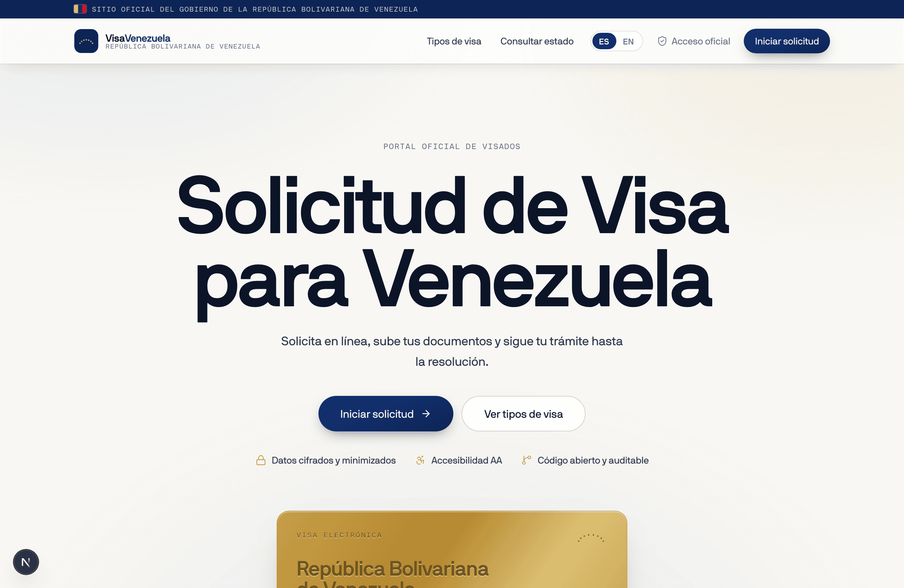
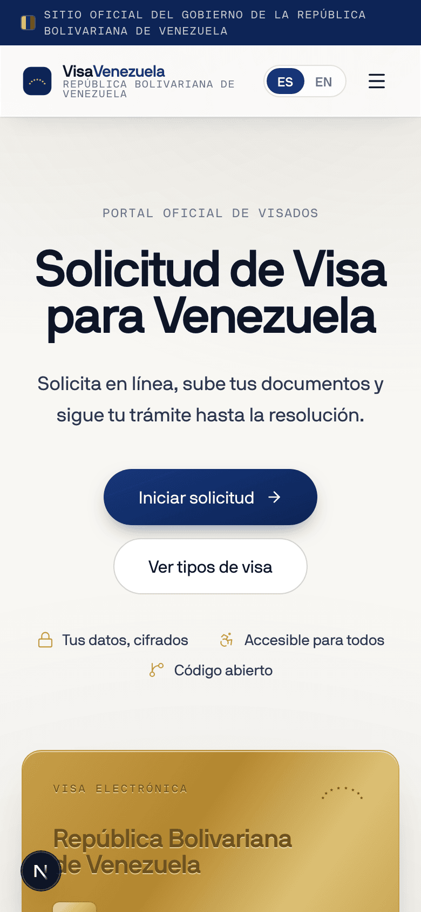
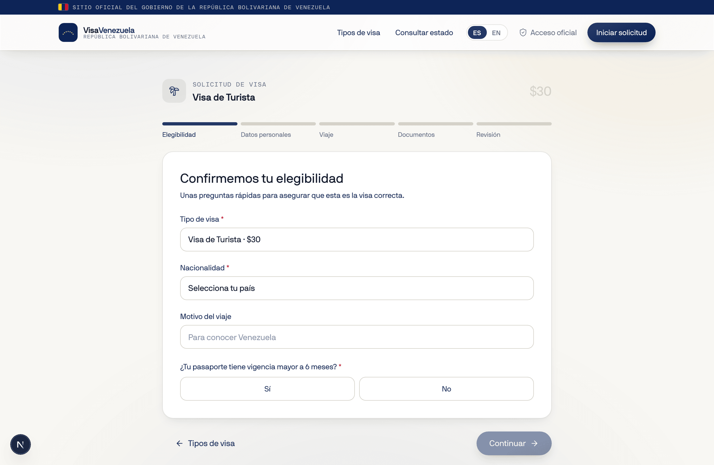
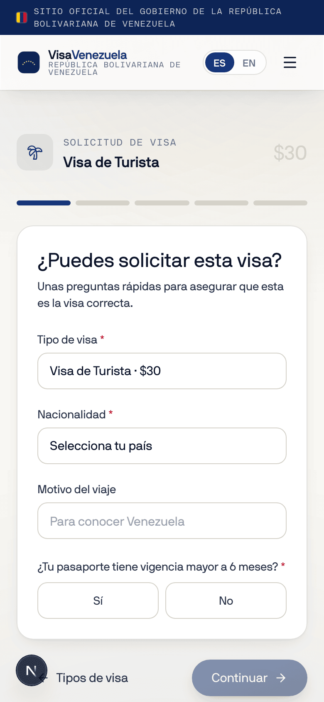
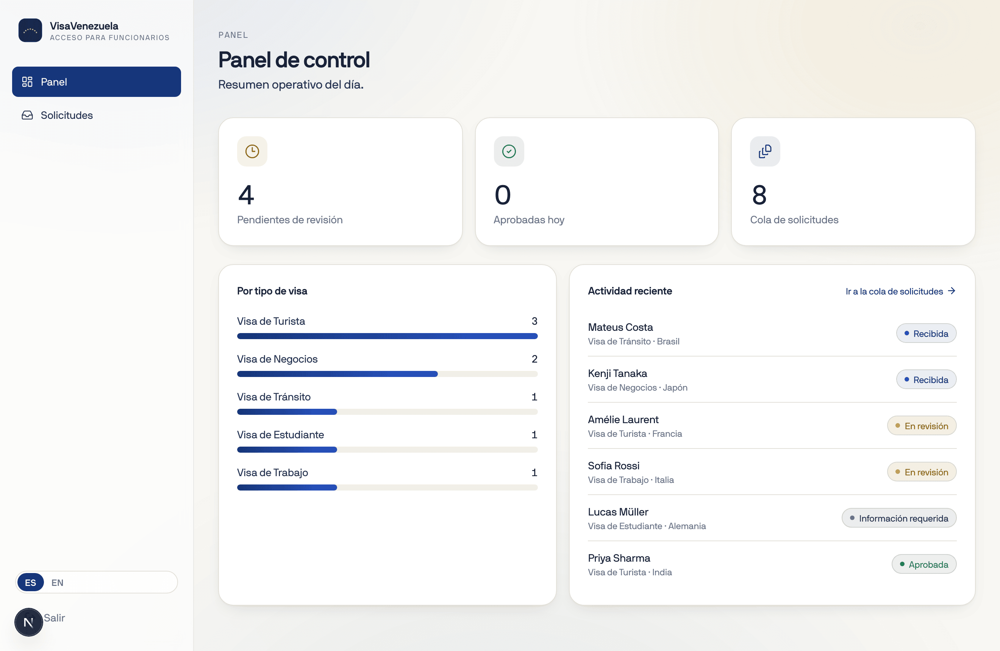

# VisaVenezuela

Open-source e-visa portal for Venezuela: the public application journey and
the officer back-office in one codebase. Spanish/English. Built to be forked
by any administration.

**Live demo:** [venezuelavisa.vercel.app](https://venezuelavisa.vercel.app)

<table>
  <tr>
    <td width="76%"></td>
    <td width="24%"></td>
  </tr>
</table>

## What's inside

**Applicants** — visa catalogue, a 5-step guided application (eligibility,
personal details, travel, documents, review), payment, and a public status
tracker with a reference number.

<table>
  <tr>
    <td width="76%"></td>
    <td width="24%"></td>
  </tr>
</table>

**Officers** (`/admin`, demo login `oficial` / `caracas2026`) — dashboard,
filterable queue, and case review with approve / reject / request-info.



## Run it

```bash
npm install
npm run dev    # http://localhost:3000
```

Works with zero configuration. Every integration runs in a clearly labeled
demo mode and switches to the real provider when its key is set:

| Feature | Demo mode | Goes live with |
| --- | --- | --- |
| Officer sessions (JWT, route-guarded) | demo account | `AUTH_SECRET`, `OFFICER_USERNAME`, `OFFICER_PASSWORD_HASH` |
| Email OTP (MX-validated, stateless) | code shown inline | `RESEND_API_KEY` |
| SMS OTP (E.164-validated) | code shown inline | `TWILIO_ACCOUNT_SID/_AUTH_TOKEN/_FROM` |
| Visa fee payment (Stripe Checkout) | inline demo sheet | `STRIPE_SECRET_KEY` |
| Address autocomplete (Places, VE-only) | plain input | `NEXT_PUBLIC_GOOGLE_MAPS_API_KEY` |

Document uploads are always validated server-side (magic bytes, size,
image resolution, sha256). See `.env.example`.

## Wiring a real backend

Application data lives in a mock client store. Replace the functions in
`src/lib/mock/api.ts` with calls to your service; the UI is already async
and doesn't care where the data comes from.

## Stack

Next.js 16 · React 19 · TypeScript · Tailwind v4 · Framer Motion.
Designed for NB International Pro (licensed, not committed — see
`public/fonts/README.md`); falls back to Helvetica Neue.

## License

Open source. Public service, reusable by any administration.
